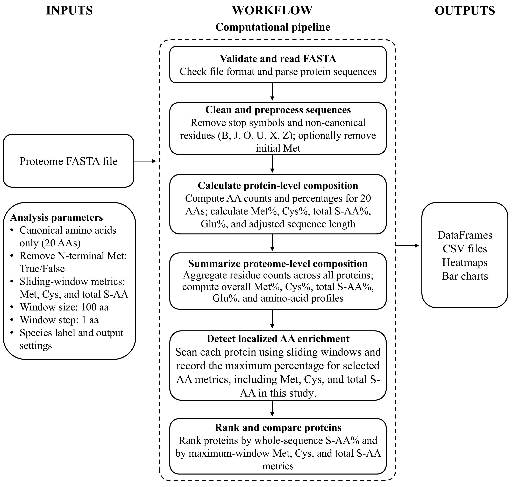

# saa_proteome
[](https://doi.org/10.5281/zenodo.21963177)
A reproducible Python library for proteome-wide amino acid composition analysis, 
with dedicated support for sulfur-containing amino acids (methionine and cysteine) 
and sliding-window enrichment analysis for individual amino acids or 
user-defined groups of canonical amino acids.

---

## Version

Current version: v0.4.1

---

## License

This project is licensed under the MIT License.

---

## Scientific Purpose

saa_proteome enables deterministic and reproducible analysis of:

- Protein-level amino acid composition  
- Proteome-level aggregated composition  
- Sulfur amino acid (SAA) metrics (Met%, Cys%, SAA%)  
- Essential amino acid (EAA) summaries   
- Sliding-window enrichment analysis for individual amino acids or
  user-defined groups of canonical amino acids
- Top-N protein ranking tables  
- Quality control (QC) and summary statistics  
- Publication-ready outputs  

All outputs are returned as pandas DataFrames and can be exported as CSV files or visualized as heatmaps and bar charts.

---

## Computational Workflow



---

## Installation

Clone the repository and install locally:

```bash
git clone https://github.com/Hussam-Omari/saa-proteome.git
cd saa-proteome
pip install -e .
```

---

## Data Source

Proteome FASTA files used in this study were obtained from UniProt reference proteomes. 
Specific proteome identifiers and download links are provided in the repository or associated publication.

---

## Output Schema

A complete description of all output variables is provided in `output_dictionary.csv`, 
including variable names, definitions, and units.

---

## Minimal Example

```python
from saa_proteome import load_proteome_metrics, saa_summary

df = load_proteome_metrics(
    fasta_path="path/to/proteome.fasta",
    species="Glycine max",
)
# Compute species-level summary
summary = saa_summary(df)
print(summary)
```

---

## Sliding-Window Enrichment Example

The sliding-window function supports individual amino acids and
user-defined amino-acid groups.

```python
from saa_proteome import max_group_pct_per_window

seq = "MMCCAAAAMMCC"

# Maximum localized methionine percentage
max_met = max_group_pct_per_window(
    seq,
    group="M",
    window_size=10,
    window_step=1,
    remove_start_m=False,
)

# Maximum localized cysteine percentage
max_cys = max_group_pct_per_window(
    seq,
    group="C",
    window_size=10,
    window_step=1,
    remove_start_m=False,
)

# Maximum localized total sulfur amino-acid percentage
max_saa = max_group_pct_per_window(
    seq,
    group="MC",
    window_size=10,
    window_step=1,
    remove_start_m=False,
)

print(max_met, max_cys, max_saa)
```

A group string is interpreted as a set of amino-acid codes. For example,
`"MC"` counts every methionine or cysteine residue within each window; it
does not search for an adjacent `MC` sequence motif.